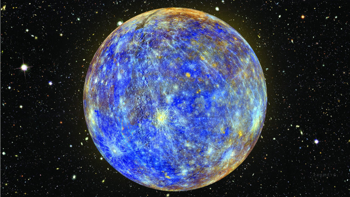

# A little insight into Nabu
Nabu was a Mesopotamian god of writing and knowledge the Roman version was Mercury. I am not a god. This README will give you a bit of information about me. 

## My Career
After 20 years in Hospitality it was time for a change. I've always been fascinated with computers and the time was right to create my own path instead of following others. After starting a diploma in Software Development, 18 months into a 2 year course I feel like I am ready to start showing what I know. 

## My Goals
So whats my schtick and why you should be interested in what I have to say. I'm living the dream, gathering knowledge and building my own future, enjoying what I'm doing and I want to document and share that journey.
I want to pull others out of the mud with me, those like me looking for direction to get ahead and warn of any mistakes I make along the way. 
" A star in the sky only shines if someone is witness to it" - Me, Now. (I'm sure someone far smarter has said something more profound)

## My Interests
My Gaming passion is what drove my interest in computing. For about 15 years the only game I played was Civ IV until recent years that's been replaced by the Total War Warhammer Series which I'll probably play for the next 15.

Very Loyal but probably stupid fan of Liverpool FC and Dallas Cowboys.

Love films and TV, currently watching The Jack Ryan Series and reading Game of Thrones- Storm of Swords-Part 2.

